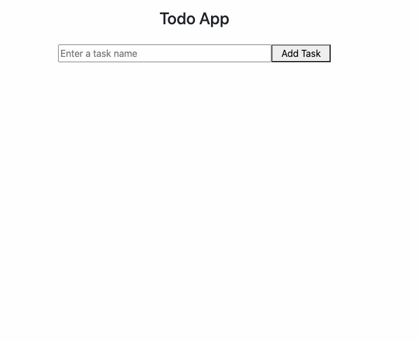

- Create a project with

  ```bash
  # Create a react .net core boiler plate in current dir with namespace TodoApi
  dotnet new react -n TodoApp
  ```

- Add a .gitignore

  ```properties
  .fake/
  obj/
  bin/
  .idea/
  ```

- open in rider

  ```
  rider .
  ```

  - We have the react project in `ClientApp`

- Run project in watch mode :

  ```bash
  dotnet watch run
  ```

  - This should open url automatically : https://localhost:5001/

- Create a controller for todo api

  ```c#
  using System.Collections.Generic;
  using Microsoft.AspNetCore.Mvc;
  
  namespace TodoApp.Controllers
  {
    [ApiController]
    [Route("/api/[controller")]
    public class TodosController
    {
      [HttpGet]
      public IEnumerable<string> GetAll()
      {
        return new List<string>() {"task-one", "task-two"};
      }
    }
  }
  ```

  - check the api :  https://localhost:5001/api/todos

    ```yaml
    [
      "task-one",
      "task-two"
    ]
    ```

- Create a TODO Model

  ```c#
  namespace TodoApp.Models{
  	public class TodoItem{
  		public string Id {get;set;}
  		public string Description {get; set;}
  		public bool IsComplete {get; set;}
  	}
  }
  ```

- Now use the model in controller

  ```diff
  [HttpGet]
  - public IEnumerable<string> GetAll()
  + public IEnumerable<TodoItem> GetAll()
   {
  -  return new List<string>() {"task-one", "task-two"};
  +   return new List<TodoItem>()
  +   {
  +     new TodoItem(){Id = "one", Description = "task one", IsCompleted = true},
  +     new TodoItem(){Id = "two", Description = "task two", IsCompleted = false},
  +     new TodoItem(){Id = "three", Description = "task three", IsCompleted = false}
  +   }; 
   }
  ```

  - now check the api again : https://localhost:5001/api/todos

    ```yaml
    # Field names are automaticaaly changed from Pascal case to camelCase in json
    [
      {
        "description": "task one",
        "id": "one",
        "isCompleted": true
      },
      {
        "description": "task two",
        "id": "two",
        "isCompleted": false
      },
      {
        "description": "task three",
        "id": "three",
        "isCompleted": false
      }
    ]
    ```


- Create a completely fake controller so that we can work on react side to create todo list 

  ```c#
  using System;
  using System.Collections.Generic;
  using System.Linq;
  using System.Threading.Tasks;
  using Microsoft.AspNetCore.Mvc;
  using TodoApp.Models;
  
  namespace TodoApp.Controllers
  {
    [ApiController]
    [Route("/api/[controller]")]
    public class TodosController : ControllerBase
    {
      private static IList<TodoItem> fakeItems = new List<TodoItem>()
      {
        new TodoItem(){Id = "one", Description = "task one", IsCompleted = true},
        new TodoItem(){Id = "two", Description = "task two", IsCompleted = false},
        new TodoItem(){Id = "three", Description = "task three", IsCompleted = false}
      };
      
      [HttpGet]
      public IEnumerable<TodoItem> GetAll()
      {
        return fakeItems; 
      }    
      [HttpGet("{id}")]
      public TodoItem GetById(string id)
      {
        return fakeItems.First(item => item.Id == id); 
      }
      
      [HttpPost]
      public ActionResult CreateItem(TodoItem data)
      {
        data.Id = $"task-{fakeItems.Count}";
        fakeItems.Add(data);
        return CreatedAtAction("GetById", new {Id = data.Id}, data);
      }
      
      [HttpPut("{id}")]
      public ActionResult GetById(string id, TodoItem data)
      {
        if (id != data.Id) return BadRequest("Ids in path and data do not match");
        
        var item = fakeItems.First(item => item.Id == id);
        if (item == null) return NotFound();
  
        item.Description = data.Description;
        item.IsCompleted = data.IsCompleted;
  
        return Ok();
      }
  
    }
  }
  ```

  

- Create a react todo list: 

  ```javascript
  // TodoApp/ClientApp/src/App.js
  
  import React, { Component } from 'react';
  import TodoApp from './components/TodoApp';
  
  import './custom.css'
  
  export default class App extends Component {
    static displayName = App.name;
  
    render () {
      return <TodoApp baseUrl={'/api'}/>;
    }
  }
  
  ```

  ```javascript
  import React from 'react';
  import './todo-app.css';
  
  const fetchItems = (baseUrl) => fetch(`${baseUrl}/todos`);
  
  const createTodoItem = (baseUrl, todo) => fetch(`${baseUrl}/todos`, {
      method: 'POST',
      headers: {'Content-Type': 'application/json'},
      body: JSON.stringify(todo)
  })
  
  const updateTodoItem = (baseUrl, todo) => fetch(`${baseUrl}/todos/${todo.id}`, {
      method: 'PUT',
      headers: {'Content-Type': 'application/json'},
      body: JSON.stringify(todo)
  });
  
  const deleteTodoItem = (baseUrl, id) => fetch(`${baseUrl}/todos/${id}`, {
      method: "DELETE"
  })
  
  const TodoApp = ({baseUrl}) => {
      const [list, setList] = React.useState([]); 
      const [isLoading, setLoading] = React.useState(true);
      const inputRef = React.useRef(null);
      
      const setupData = async () => {
          const response = await fetchItems(baseUrl);
          const data = await response.json();
          setList(data);
          setLoading(false);
      };
  
      React.useEffect(() => {
          setupData()
          return () => {}
      }, [isLoading]); 
      
      const onCreateItem = async () => {
          const description = inputRef.current.value;
          setLoading(true);
          const result = await createTodoItem(baseUrl, {description});
        setLoading(false);
          inputRef.current.value = '';
      };
      
      const setTaskStatus = async (item, isCompleted) => {
          setLoading(true);
          await updateTodoItem(baseUrl, {...item, isCompleted});
          setLoading(false);
      };
      
      const onRemoveItem = async (e, item) => {
          e.preventDefault();
          setLoading(true);
          await deleteTodoItem(baseUrl, item.id);
          setLoading(false);
      }
      
      const content = <div className='todo-app-container'>
          <form>
              <input disabled={isLoading} placeholder="Enter a task name" ref={inputRef}/>
              <button disabled={isLoading} onClick={onCreateItem}>Add Task</button>
          </form>
          <ul className='todo-list'>
              {list.map(item => (<li className="todo-list-item" key={item.id}>
                  <input
                      type='checkbox' 
                      checked={item.isCompleted} 
                      onChange={(e) => setTaskStatus(item, e.target.checked)}/>
                      <label>{item.description}</label>
                      <a href="#" onClick={(e) => onRemoveItem(e, item)}>remove</a>
              </li>))}
              
          </ul>
      </div>;
      
      return (
          <>
              <h3>Todo App</h3>
              {content}
          </>
      );
  };
  
  export default TodoApp;
  ```
  


- Check app : https://localhost:5001/

  